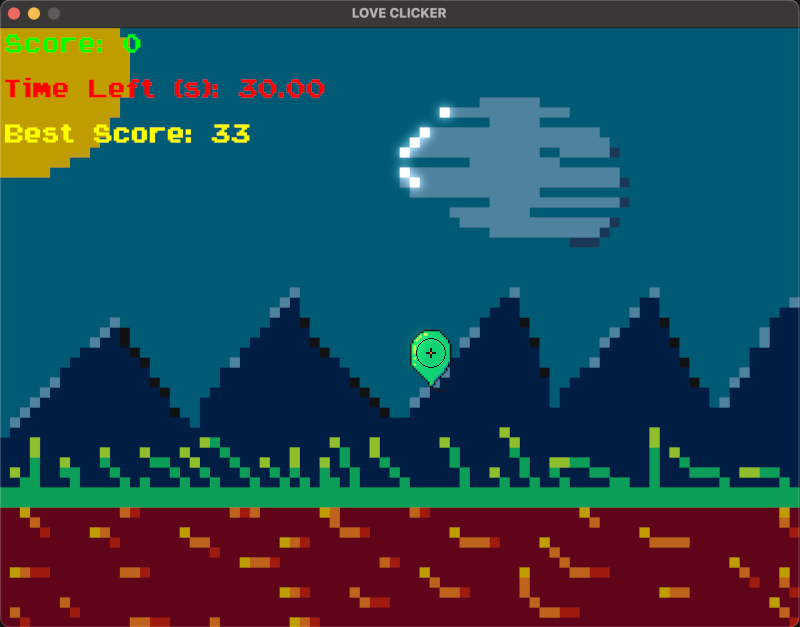

# LOVE Clicker
A simple game written in the LOVE framework. Destroy as many balloons as possible within a given time limit.

## Screenshots

## Addons
* [LÖVE](https://love2d.org) framework official website
* [OOO library](https://github.com/rxi/classic)
* [Input library](https://github.com/a327ex/boipushy)
* [Shader library](https://github.com/vrld/moonshine)
* [Font](https://www.dafont.com/super-meatball.font)
